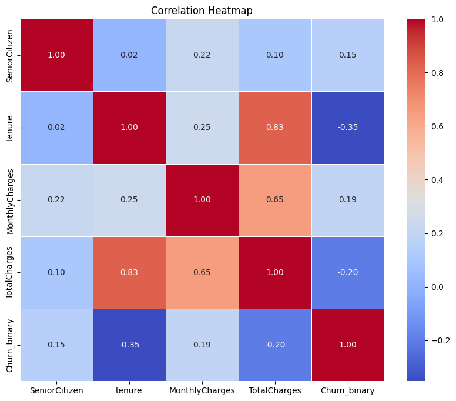
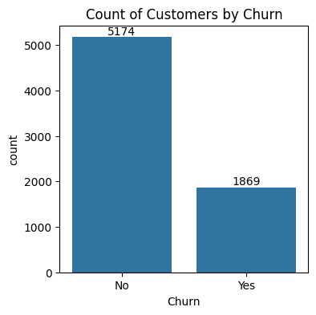
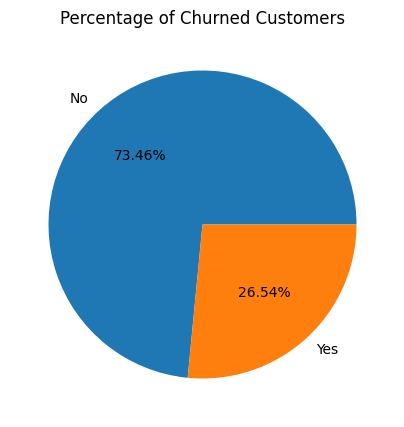
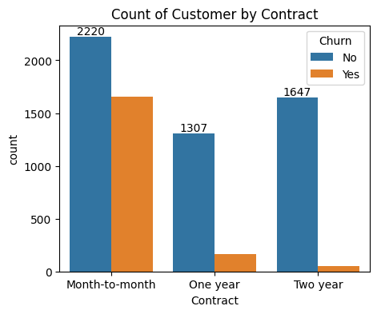
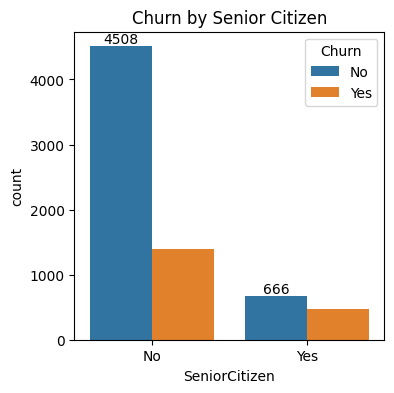
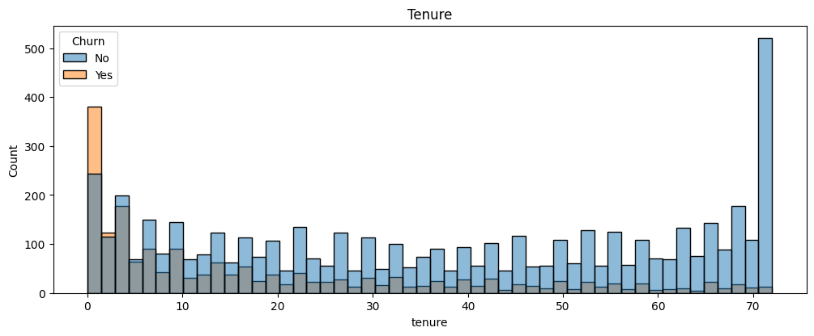
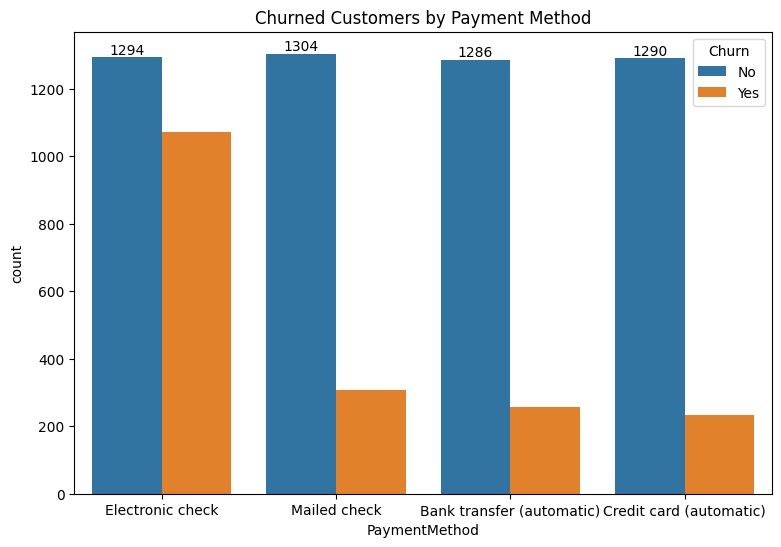
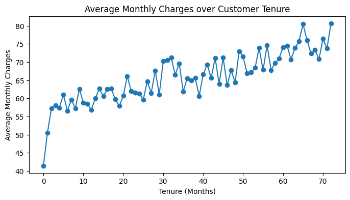
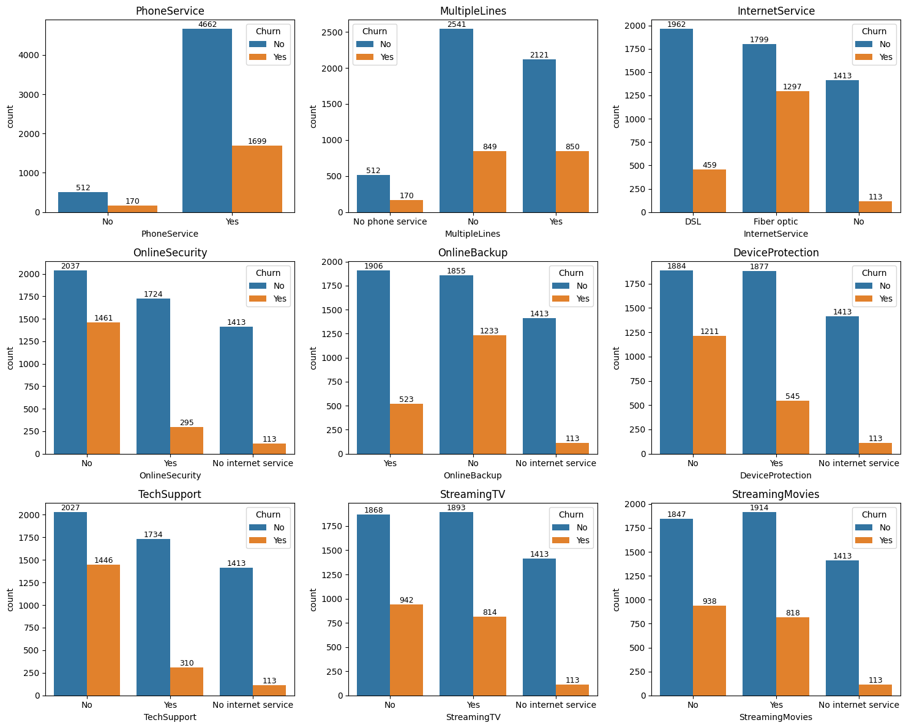
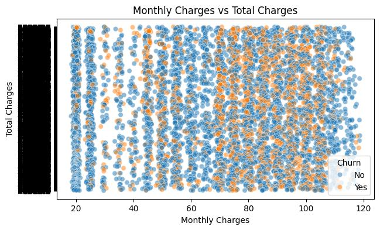

<div align="center">

# 📊 Telco Customer Churn — Exploratory Data Analysis

### Uncovering *why* customers leave, using data.

[](https://www.python.org/)
[](https://pandas.pydata.org/)
[](https://seaborn.pydata.org/)
[](https://scipy.org/)
[](https://jupyter.org/)
[](LICENSE)

*An end-to-end exploratory data analysis of 7,043 telecom customers to identify the strongest behavioural and contractual drivers of churn — backed by statistical hypothesis testing.*



</div>

---

## 🎯 Project Overview

Customer churn is one of the most expensive problems in subscription businesses — acquiring a new customer costs far more than retaining an existing one. This project performs a rigorous **exploratory data analysis (EDA)** on the popular **Telco Customer Churn dataset** to answer one core business question:

> **"Which customers are leaving, and why?"**

The analysis moves from raw data cleaning, through univariate and segment-level analysis, into correlation and **chi-square hypothesis testing**, culminating in clear, actionable retention recommendations for the business.

---

## 🗂️ Table of Contents

- [Dataset](#-dataset)
- [Key Findings](#-key-findings)
- [Statistical Testing](#-statistical-testing)
- [Visual Highlights](#-visual-highlights)
- [Tech Stack](#-tech-stack)
- [Project Structure](#-project-structure)
- [How to Run](#-how-to-run)
- [Business Recommendations](#-business-recommendations)
- [Future Work](#-future-work)
- [Author](#-author)

---

## 📁 Dataset

| Attribute | Detail |
|---|---|
| **Source** | [Telco Customer Churn Dataset](https://www.kaggle.com/datasets/blastchar/telco-customer-churn) |
| **Records** | 7,043 unique customers |
| **Features** | 21 attributes — demographics, account info, subscribed services, billing, and churn status |
| **Target Variable** | `Churn` (Yes / No) |
| **Data Quality** | 0 duplicate rows, 0 duplicate customer IDs, 0 missing values after cleaning |

**Cleaning steps performed:**
- Converted blank `TotalCharges` entries to `0` and cast the column from `object` → `float`.
- Recoded the numeric `SeniorCitizen` flag (`0`/`1`) into readable categorical labels (`No`/`Yes`).
- Verified the dataset for nulls and duplicates — confirmed clean and analysis-ready.

---

## 🔑 Key Findings

| # | Insight |
|---|---|
| 1 | **26.54%** of customers have churned, against a **73.46%** retention base. |
| 2 | **Month-to-month** contract holders churn far more than **1-year** or **2-year** contract customers. |
| 3 | Churn is heavily concentrated in the **first 1–2 months** of tenure — the highest-risk retention window. |
| 4 | **Fiber optic** subscribers without **Online Security** or **Tech Support** show the highest churn among all service segments. |
| 5 | **Electronic Check** is the payment method most strongly associated with churn. |
| 6 | **Senior citizens** churn at a proportionally higher rate than non-senior customers. |
| 7 | Tenure and Total Charges are **strongly positively correlated** (r = 0.83); tenure is **negatively correlated** with churn (r = −0.35). |

<p align="center">
  
  
</p>

<details>
<summary><b>📈 Full Correlation Matrix (click to expand)</b></summary>

| Relationship | Correlation (r) | Interpretation |
|---|---|---|
| Tenure ↔ Total Charges | 0.83 | Strong positive — longer tenure drives higher cumulative billing |
| Monthly Charges ↔ Total Charges | 0.65 | Moderate positive |
| Tenure ↔ Churn | −0.35 | Moderate negative — longer tenure reduces churn likelihood |
| Total Charges ↔ Churn | −0.20 | Weak negative |
| Monthly Charges ↔ Churn | 0.19 | Weak positive |
| Senior Citizen ↔ Churn | 0.15 | Weak positive |

</details>

---

## 🧪 Statistical Testing

To confirm that observed patterns weren't due to chance, a **Chi-Square Test of Independence** was run between `Churn` and `Contract` type:

```
χ² Test: Churn × Contract
p-value ≈ 5.86 × 10⁻²⁵⁸
```

At any conventional significance threshold (α = 0.05), this result **overwhelmingly rejects the null hypothesis** of independence — confirming with very high statistical confidence that **contract type is a genuine, significant driver of churn behaviour**.

<p align="center">
  
</p>

---

## 🖼️ Visual Highlights

<table>
<tr>
<td width="50%">

**Churn by Senior Citizen Status**


</td>
<td width="50%">

**Tenure Distribution by Churn**


</td>
</tr>
<tr>
<td width="50%">

**Churn by Payment Method**


</td>
<td width="50%">

**Avg. Monthly Charges vs. Tenure**


</td>
</tr>
</table>

**Service Subscriptions vs. Churn** (9-panel breakdown across Phone, Internet, Security, Backup, Device Protection, Tech Support, and Streaming services)

<p align="center">
  
</p>

**Monthly Charges vs. Total Charges** (colored by churn status)

<p align="center">
  
</p>

> The complete, presentation-ready report with full commentary is available in [`Telco_Customer_Churn_Report.pdf`](./Notebook/Telco_Customer_Churn_Report.pdf).

---

## 🛠️ Tech Stack

| Category | Tools |
|---|---|
| **Language** | Python 3 |
| **Data Handling** | Pandas, NumPy |
| **Visualization** | Matplotlib, Seaborn |
| **Statistical Testing** | SciPy (`chi2_contingency`) |
| **Environment** | Jupyter Notebook |

---

## 📦 Project Structure

```
Customer-Churn-Analysis-Python/
│
├── images/                              # Chart images used in this README
│   ├── fig01_partner_status.png
│   ├── fig02_churn_count.png
│   ├── fig03_churn_percentage.png
│   ├── fig04_churn_by_gender.png
│   ├── fig05_churn_by_senior_citizen.png
│   ├── fig06_tenure_distribution.png
│   ├── fig07_churn_by_contract.png
│   ├── fig08_service_subscriptions.png
│   ├── fig09_churn_by_payment_method.png
│   ├── fig10_avg_monthly_charges_vs_tenure.png
│   ├── fig11_monthly_vs_total_charges.jpeg
│   └── fig12_correlation_heatmap.png
│
├── Data/
│   └── Telco Customer Churn.csv         # Raw dataset (7,043 records, 21 attributes)
│
├── Notebook/
│   ├── Telco customer churn final.ipynb # Main analysis notebook (cleaning → EDA → hypothesis testing)
│   └── Telco_Customer_Churn_Report.pdf  # Polished, presentation-ready EDA report
│
├── LICENSE                              # MIT License
└── README.md                            # You are here
```

---

## 🚀 How to Run

```bash
# 1. Clone the repository
git clone https://github.com/YOUR-GITHUB-USERNAME/Customer-Churn-Analysis-Python.git
cd Customer-Churn-Analysis-Python

# 2. Install dependencies
pip install pandas numpy matplotlib seaborn scipy jupyter

# 3. Launch the notebook
jupyter notebook "Notebook/Telco customer churn final.ipynb"
```

---

## 💡 Business Recommendations

Based on the analysis, the following retention strategies are recommended:

- 🎯 **Target the first 60 days** — Prioritise onboarding support and proactive outreach in a customer's first 1–2 months, the highest churn-risk window.
- 📄 **Incentivise longer contracts** — Offer discounts or service credits to migrate month-to-month customers onto 1- or 2-year plans.
- 💳 **Fix the Electronic Check experience** — Investigate friction points and encourage migration to automatic payment methods, which show markedly lower churn.
- 🛡️ **Bundle protection services** — Promote Online Security and Tech Support add-ons for Fiber optic customers, the highest-churn service segment.
- 👴 **Senior-focused retention** — Design targeted retention programs for senior citizens, who churn at a disproportionately higher rate.

---

## 🔮 Future Work

- [ ] Build a supervised **churn prediction model** (Logistic Regression, Random Forest, XGBoost) using the features identified here.
- [ ] Engineer features such as `tenure_bucket`, `services_count`, and `has_addons` to boost predictive power.
- [ ] Deploy an interactive **Streamlit/Power BI dashboard** for real-time churn monitoring.
- [ ] Perform a **cost-benefit analysis** to quantify potential revenue saved through targeted retention actions.

---

## 👤 Author

**Vikram Kumar**

📧 connectwithvikramkumar@gmail.com &nbsp;|&nbsp; 🔗 [LinkedIn](https://www.linkedin.com/in/vikramkumar4/?lipi=urn%3Ali%3Apage%3Ad_flagship3_profile_view_base_contact_details%3Bhj7DuOmSQ%2FKXSyJCSN2bWA%3D%3D) &nbsp;|&nbsp; 💻 [GitHub](https://github.com/vikramkumar-2)

<div align="center">

⭐ **If you found this project insightful, consider giving it a star!** ⭐

</div>

---

## 📄 License

This project is licensed under the [MIT License](LICENSE).
